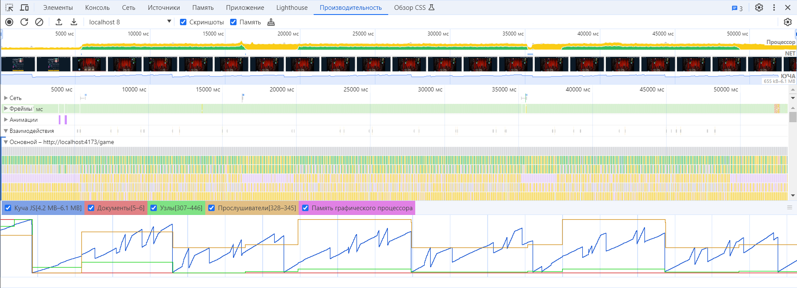
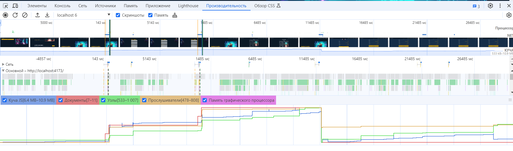
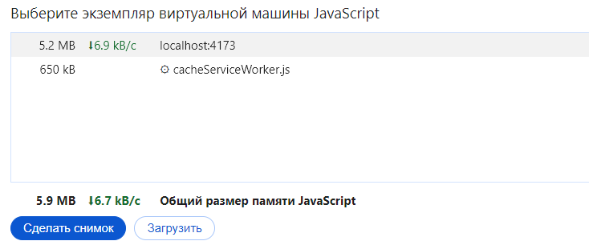
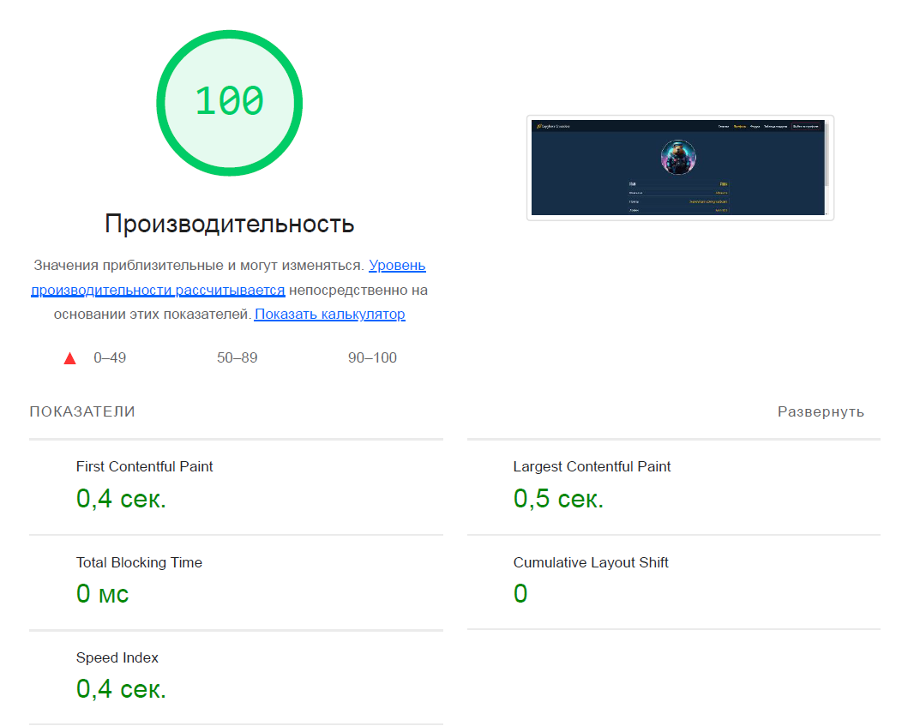
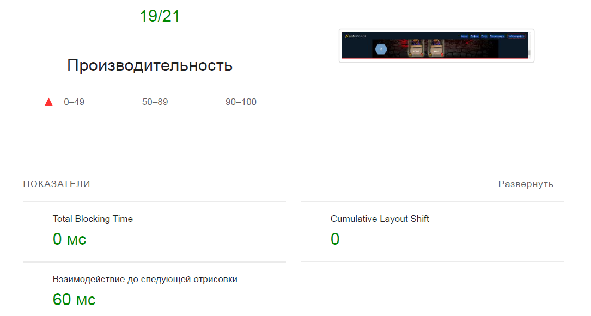

# Утечки памяти

Поиск возможных утечек памяти осуществлялся на вкладке с игрой, а также при переходах по страницам приложения.
Исследовалась production-сборка приложения, которая запускалась в инкогнито-режиме для исключения влияния сторонних расширений.

### Вкладка Performance

Для получения данных производительности была сделана запись страницы с игрой, на которой воспроизводились действия игрока:
было проиграно несколько игровый партий с разным исходом.

Критических утечек памяти обнаружено не было, скачки на графике в основном происходят в моменты разыгрывания карт и воспроизведения карточных анимаций, однако память после них постепенно освобождается и глобальных выбросов на графике не наблюдается во всех игровых партиях.

Также осуществлялась запись производительности при переходах по страницам приложения.

Утечек памяти обнаружено не было.

### Вкладка Memory

При воспроизведении нескольких игровых партий подряд размер потребляемой памяти оставался в пределах нормы, длительного увеличения размера потребляемой памяти не наблюдалось.

### Вкладка Lighthouse

Помимо наличия возможных утечек памяти приложение также исследовалось на соотвестсие метрикам Web Vitals.
Отчет Lighthouse составлялся в режиме _Навигация (по умолчанию)_ для страниц, а также в режиме _Анализ временного диапазона_ с целью имитации действий пользователя в приложении.

По данным, полученным в отчетах в режиме _Навигация (по умолчанию)_, все страницы приложения соотвествуют стандартам метрик Web Vitals.

По данным, полученным в отчете в режиме _Анализ временного диапазона_, приложение соответсвует стандартам метрик Web Vitals.

### Выводы

При анализе производительности приложения, на данном этапе разработки критических утечек памяти обнаружено не было, также приложение соотвествует стандартам метрик Web Vitals.
